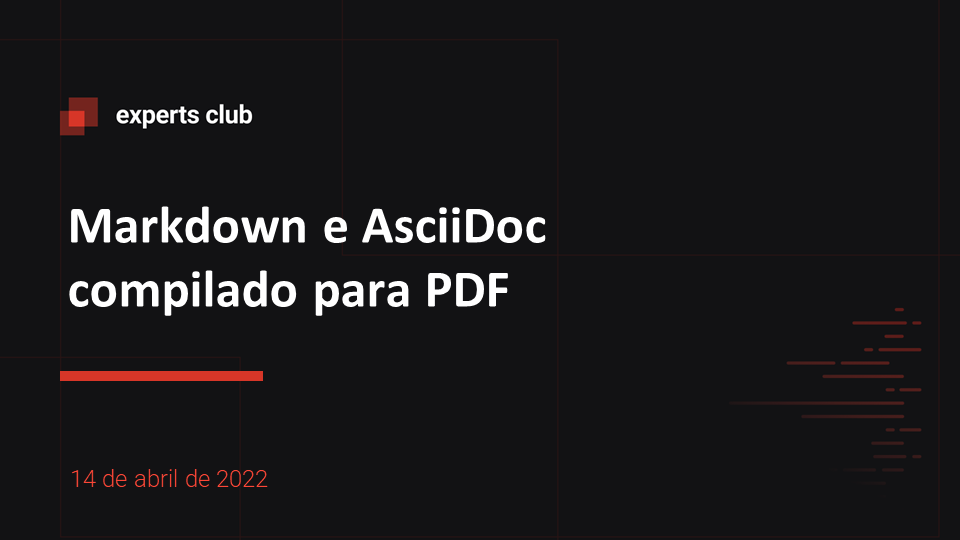
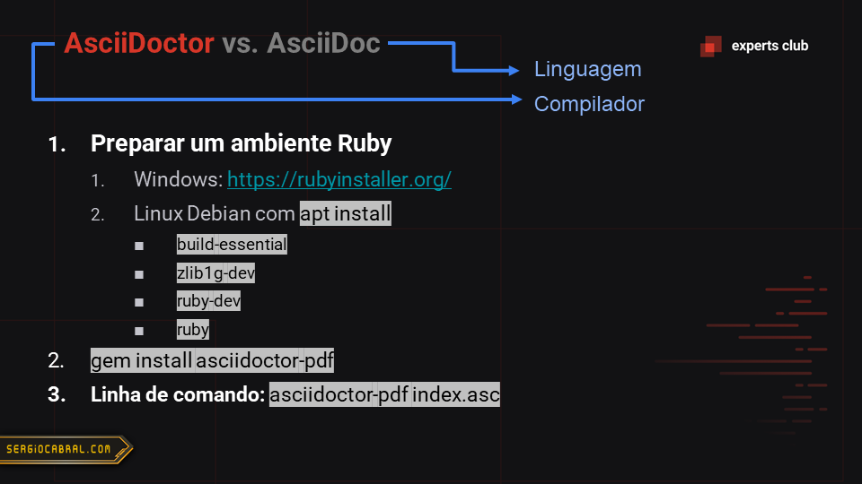

# AsciiDoctor compilando Markdown e AsciiDoc para PDF

## Instalação

- Instalação do ambiente Ruby:
  - **Windows**
    - [rubyinstaller.org/downloads](https://rubyinstaller.org/downloads/)
  - **Linux Debian**
    - `sudo apt update && sudo apt install -y build-essentials zlib1g-dev ruby-dev ruby`
- Instalação do AsciiDoctor
  - `gem install asciidoctor`
  - `gem install asciidoctor-pdf`
  - `gem install asciidoctor-epub3`

## Compilando PDF

Para compilar arquivos MarkDown ou AsciiDoc use:

- Para HTML: `asciidoctor <nome-do-arquivo>`
- Para PDF: `asciidoctor-pdf <nome-do-arquivo>`
- Para EPUB: `asciidoctor-epub3 <nome-do-arquivo>`

### Livro ProGit

Este repositório contém o manual oficial do Git disponível em [git-scm.com/book](https://git-scm.com/book/) na versão brasileira.

Veja o [README](./README2.asc) original.

Para compilar o livro em PDF use: `asciidoctor-pdf ./progit.asc`

Se quiser contribuir com traduções a partir do livro original, envie seus pull requests para [github.com/progit/progit2-pt-br/pulls](https://github.com/progit/progit2-pt-br/pulls)

## Slides da aula

## Expert

|  |
| :-: |
|[sergiocabral.com](https://sergiocabral.com)|
